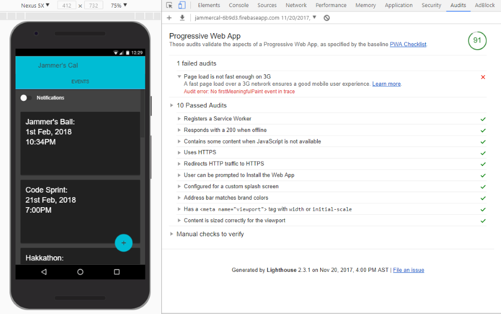

# Jammers Cal PWA Starter

## Preview


## Features (Using Sw-Precache)
1. Add to homescreen
2. Pre caching resource files with sw-precache (Splash screens display mode not working with workbox)
3. Runtime Caching with sw-precache/sw-toolbox to cache events
4. Background Sync - allows adding new events while offline, used dixie for indexed db storage,
5. Push notifications with fcm, notifies the user when event is send at background sync.

## Requirements
1. [Chrome](https://www.google.com/chrome/browser/desktop/index.html)
2. A firebase [project](https://accounts.google.com/signin/v2/identifier?passive=1209600&osid=1&continue=https%3A%2F%2Fconsole.firebase.google.com%2F&followup=https%3A%2F%2Fconsole.firebase.google.com%2F&flowName=GlifWebSignIn&flowEntry=ServiceLogin)
3. [Postman](https://www.getpostman.com/apps)
4. [Node.js and npm](https://nodejs.org/en/download/)

## Installation
1. Clone Repo
2. run ```$ npm install ```

## Running
1. Add firebase config to key.js
2. run ```$ npm run build ```
3. then run ```$ npm run start```

## Using Postman
1. Run app, enable notifications, copy client token (from js console) and fcm server key (from firebase console>option>cloud messaging) to FCM.postman_environment.json
2. import collection and environment files into postman

## Useful Resources
1. [Notifications](https://web-push-book.gauntface.com/demos/notification-examples/)
2. [Pre Caching, Runtime Caching](https://github.com/GoogleChromeLabs/sw-precache)
3. [Messaging API](https://firebase.google.com/docs/cloud-messaging/js/client)
